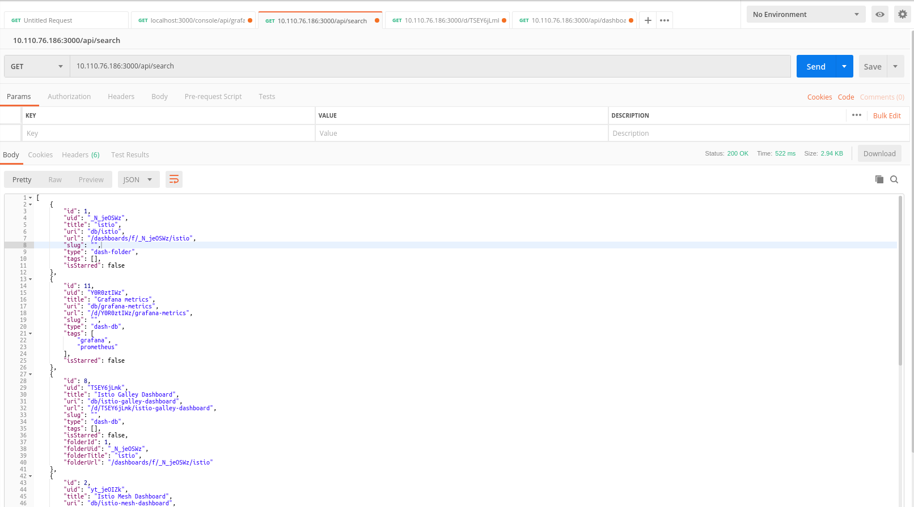

## 개발 방향

### 2019.07.10 개발 일지

* 우선 아래와 같이 `kiali_cr.yaml`파일을 수정하여 `kiali` pod를 배포했다. `Grafana`설정을 추가했다.

  ```yaml
  apiVersion: kiali.io/v1alpha1
  kind: Kiali
  metadata:
    name: kiali
  annotations:
    ansible.operator-sdk/reconcile-period: "0s"
  spec:
    auth:
      strategy: "anonymous"
    deployment:
      image_name: "soda2019/aladdin"
      image_pull_policy: "IfNotPresent"
      image_version: "jiyong"
      namespace: "istio-system"
      service_type: "NodePort"
    external_services:
      grafana:
        auth:
          ca_file: ""
          insecure_skip_verify: true
          password: ""
          token: ""
          type: "none"
          use_kiali_token: false
          username: ""
        enabled: true
        // grafana service url 
        in_cluster_url: "http://10.110.76.186:3000"
        url: "http://10.110.76.186:3000"
  ```

* 그럼 이제 `kiali`, `kiali-ui`중 일단 `kiali`부터 살펴보도록 하자.

  * `vscode`로 `kiali`에서 "workloadDashboard" 단어로 검색을 하면 `grafana.go`등 다양한 파일을 찾아볼 수 있다.

  * 이 파일을 잘 살펴보면 `getGrafanaInfo`, `getDashboardPath`와 같은 함수가 있다. 

  * `GetGrafanaInfo`함수 맨 마지막 부분은 다음과 같다.

    ```go
    info, code, err := getGrafanaInfo(requestToken, findDashboard)
    	if err != nil {
    		log.Error(err)
    		RespondWithError(w, code, err.Error())
    		return
    	}
    	RespondWithJSON(w, code, info)info, code, err := getGrafanaInfo(requestToken, findDashboard)
    	if err != nil {
    		log.Error(err)
    		RespondWithError(w, code, err.Error())
    		return
    	}
    	RespondWithJSON(w, code, info)
    ```

    * `RespondWithJSON`함수를 따라가보면 결국 `kiali`는 Grafana 정보들을 요청한 클라이언트에게 보낸다.

      ```go
      func RespondWithJSON(w http.ResponseWriter, code int, payload interface{}) {
      	response, err := json.Marshal(payload)
      	if err != nil {
      		response, _ = json.Marshal(map[string]string{"error": err.Error()})
      		code = http.StatusInternalServerError
      	}
      
      	w.Header().Set("Content-Type", "application/json")
      	w.WriteHeader(code)
      	w.Write(response)
      }
      ```

  * 그러면 이제 어떻게 개발을 진행해야 할까?

    * 우선 `api`를 먼저 살펴보자. `vscode`에서 `api/grafana`로 검색하면 `routes.go`파일이 있고 각종 api를 볼 수 있다. 이것을 사용하면 `Grafana`의 `istio-mesh-dashboard` 정보를 가져올 수 있지 않을까?
      (`kiali-ui`의 `src/config/Config.ts`파일에도 각종 api에 관한 정보가 작성되어 있다.)

    * 일단 `kiali-ui`는 제쳐놓고 `Postman`이라는 툴을 사용하여 `kiali`에 api를 사용하여 요청을 보내보자.

      

      * `GET - 10.110.76.186:3000/api/search`를 입력해서 요청을 보내면 각종 Grafana Dashboards의 정보들을 볼 수 있다.
        (`10.110.76.186:3000`은 `kubectl get svc -A`을 했을 때 나오는 Grafana의 주소 및 포트이다)

    * https://grafana.com/docs/http_api/dashboard/#gets-the-home-dashboard 를 참고해서 여러가지 요청을 보내보자.

    * 그런데 `kiali`를 살펴보면 `istio-service-dashboard`, `istio-workload-dashboard` 밖에 정의해놓지 않았다. 그럼 우리가 사용하려는 `istio-mesh-dashboard`안의 테이블을 어떻게 가져와야 할까?

    * 결론은 우리가 직접 `kiali`의 `API`안에 우리만의 API를 만들어야 한다는 것이다. `istio-mesh-dashboard`를 직접 불러오도록 코드를 작성한 다음 `Postman`을 사용하여 요청을 보낸 후 기대한 값이 제대로 나온다면(`istio-service-dashboard`, `istio-workload-dashboard`의 결과와 비교해보자. `url`값이 잘 나오는지 확인하자) `kiali-ui`도 수정한다. 
